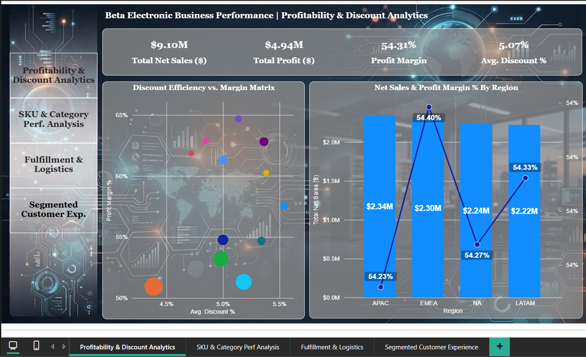
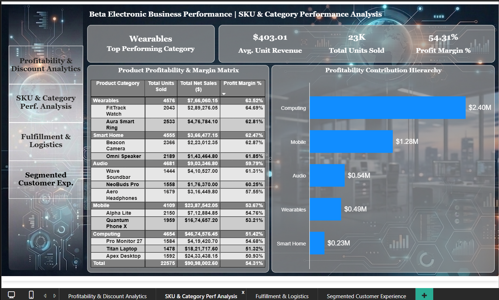
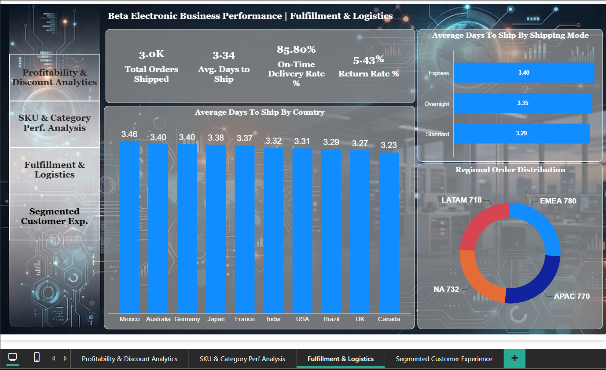
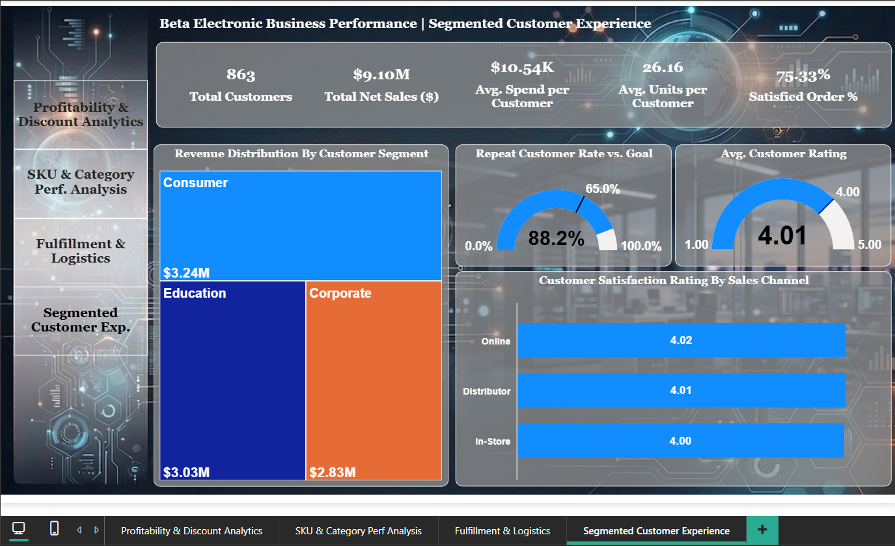

# Beta Electronic Business Performance Analytics

# Company Name:- Beta Electronic Inc.

-----

### Executive Overview:-
Beta Electronic Inc. operates across multiple international regions delivering high-tech consumer electronics, enterprise hardware, and smart appliances. To sustain competitive growth, evaluate channel profitability, and streamline global logistics, this interactive 4-page Power BI dashboard offers End-to-End operational visibility.

The primary objective of this project is to bridge raw transactional data with executive decision-making. By consolidating data across **Finance, Inventory, Fulfillment, and Customer Feedback**. The analytics suite allows stakeholders to identify margin leaks, optimize regional supply chains, and capitalize on high-yielding product categories.

-----

### Project Summary:-
This project delivers an interactive, 4-Page Power BI dashboard designed to evaluate End-to-End business performance for **Beta Electronic Inc.**
Built using **Advanced DAX, structured data modeling, and a custom glassmorphism visual layout**. The solution translates transactional data into four actionable executive views:

- **Profitability & Discount Analytics**: Evaluates $9.10M Net Sales and $4.94M Profit (54.31% Profit Margin), analyzing regional revenue distribution and discount efficiency.
- **SKU & Category Performance**: Analyzes product margins across 23K units sold, identifying high-volume drivers (Computer are at 51.42% Profit Margin) versus high-margin growth categories (Wearables at 63.52% Profit Margin).
- **Fulfillment & Logistics**: Tracks supply chain efficiency across 3,000 orders, monitoring key benchmarks including Average Shipping Time 3.34 Days, On-Time Delivery 85.80% and Return Rates 5.43%.
- **Segmented Customer Experience**: Measures account behavior across 863 active customers, highlighting strong Repeat Rustomer Retention 88.2% vs. 65.0% Target and Channel Satisfaction Scores 4.01 / 5.00.

---

### Dataset Description (Processed Data):-
The dataset consists of 3001 records with 28 structured columns.

### Columns Name (Processed Data):-
- Order Date
- Ship Date
- Order ID
- Sales Channel
- Order Priority
- Product ID
- Product Category
- Product Name
- Unit Cost ($)
- Unit Price ($)
- Customer ID
- Customer Name
- Customer Segment
- Country
- Region
- City
- Quantity
- Gross Sales ($)
- Discount %
- Discount Amount ($)
- Net Sales ($)
- Total Cost ($)
- Gross Profit ($)
- Profit Margin %
- Shipping Cost ($)
- Ship Mode
- Delivery Status
- Customer Rating

---

### Tools Used:-
- Google Sheets
- Power Bi
- AI (Gemini)
- Gamma AI Presentation
- Microsoft PowerPoint

---

### Dashboard Preview:-

----

